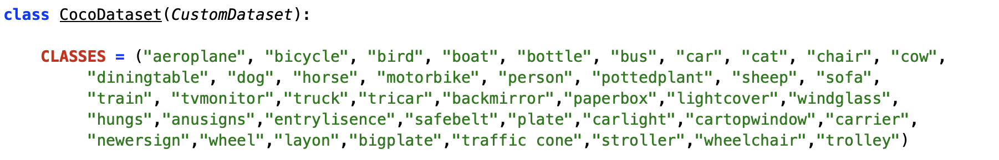
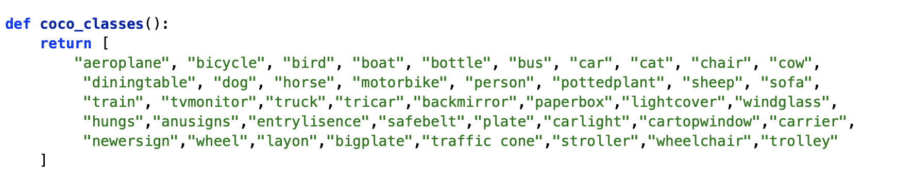
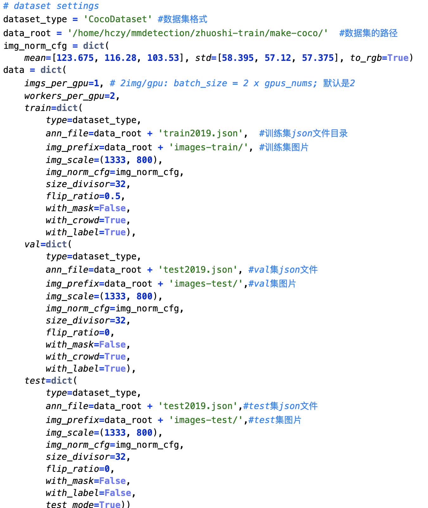
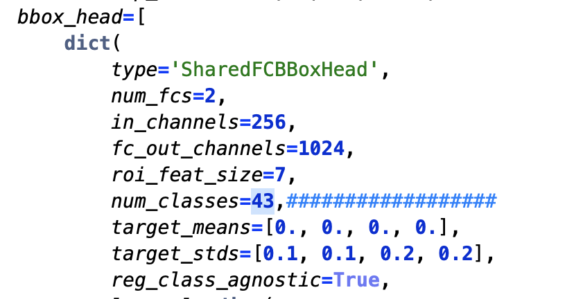
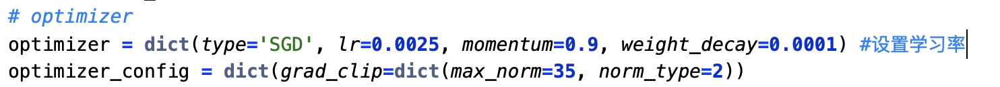
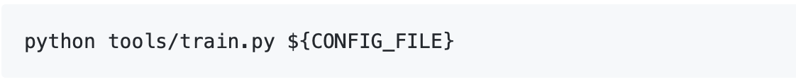

# Train
- ### 数据集准备（以coco格式的数据集为例）
  #### step 1 前期准备：将自己的数据集转换为coco格式的数据集。
  ##### 1、labelImg2coco.py: 将labelImg 格式数据转为 coco数据集格式
  ##### 2、labelme2coco: 将labelme 格式的数据转为 coco数据集格式 [here](https://github.com/ming71/toolbox)
  #### step2 具体有两种方法，
  ##### *method 1* ：以coco的数据格式为基础，修改各个文件。具体为：
  ##### a、定义数据种类，定义数据种类，需要修改的地方在mmdetection/mmdet/datasets/coco.py。把CLASSES的那个tuple改为自己数据集对应的种类tuple即可.
  

  ##### b、接着在mmdetection/mmdet/core/evaluation/class_names.py修改coco_classes数据集类别，这个关系到后面test的时候结果图中显示的类别名称。
  

  ##### c、修改configs/***.py中的model字典中的num_classes、data字典中的img_scale和optimizer中的lr(学习率)。见 *修改配置文件* 步骤
  
  ##### *method 2* ：定义自己的数据集格式（waiting）
  
- ### 修改配置文件
  ##### 以configs/cascade_rcnn_x101_64x4d_fpn_1x.py为例：
  ##### 1、修改 config 中数据集
  
  ##### 2、修改num_classes：
  ###### 不同的detector中：修改num_classes 个数不同。
  
  ##### 3、修改学习率：
  ##### 当gpu数量为8时, lr=0.02；当gpu数量为4时,lr=0.01；当gpu个数为1，所以设置lr=0.0025
  
  ##### 4、详细见 mmdetection-train/cascade_rcnn_x101_64x4d_fpn_1x.py（后续会逐渐添加注释信息）

- ### 训练命令行解析
  #### 1、单gpu 训练：
  

  ##### *python tools/train.py  configs/cascade_rcnn_x101_64x4d_fpn_1x.py   --work_dir   mmdetection/work_dir*
  #### 2、多gpu 训练(waiting)
